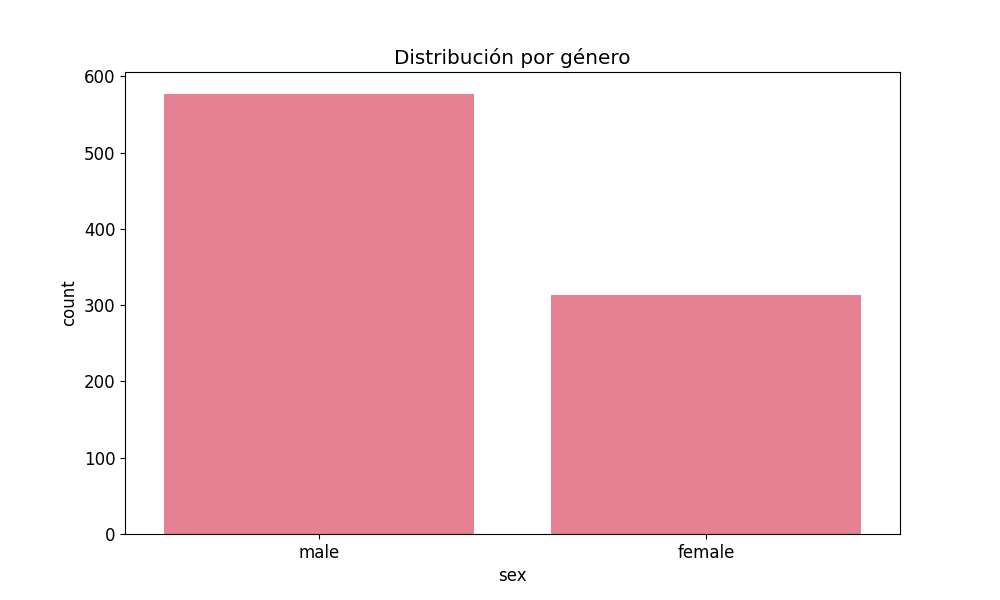

# Actividad 1: Laboratorio Práctico en Google Colab

## Estructura del Proyecto

```
├── 01_Fundamentos_NumPy_Pandas
│   ├── 01_Fundamentos_NumPy_Pandas.ipynb
│   └── images
│       └── 01_iris_petal_ratio.png
│
├── 02_Visualizacion_Datos
│   ├── 02_Visualizacion_Datos.ipynb
│   └── images
│       ├── 02_titanic_genero.png
│       ├── 02_titanic_edad_clase.png
│       └── 02_wine_plot_interactivo.html
│
├── 03_Machine_Learning_Basico
│   └── 03_Machine_Learning_Basico.ipynb
│
├── 04_Deep_Learning_Intro
│   └── 04_Deep_Learning_Intro.ipynb
│
└── README.md
│
└── requirements.txt
```

## Menú

- [Notebook 1 – Fundamentos NumPy y Pandas](./01_Fundamentos_NumPy_Pandas/01_Fundamentos_NumPy_Pandas.ipynb)
  - 
- [Notebook 2 – Visualización de Datos](./02_Visualizacion_Datos/02_Visualizacion_Datos.ipynb)
  - 
  - 
  - [Ver gráfico interactivo Wine](https://steven-sanchez-uees.github.io/UEES-IA-Semana1-Grupo2/02_Visualizacion_Datos/images/02_wine_plot_interactivo.html)
- [Notebook 3 – Machine Learning Básico](./03_Machine_Learning_Basico/03_Machine_Learning_Basico.ipynb)
- [Notebook 4 – Introducción a Deep Learning](./04_Deep_Learning_Intro/04_Deep_Learning_Intro.ipynb)

## Reporte

### Fundamentos NumPy y Pandas
En el análisis se identificaron diferencias claras entre tipos de flores al comparar la proporción entre el largo y ancho de sus pétalos; Esta métrica permitió visualizar patrones que podrían ser útiles para clasificarlas automáticamente.

- Se trabajó con el dataset **Iris**.
- Se analizaron y manipularon datos utilizando arrays y DataFrames.
- Se creó una nueva métrica "petal_ratio" que permitió observar diferencias entre especies de flores.

### Visualización de Datos
El análisis del Titanic evidenció que la edad y el género estuvieron relacionados con la clase del pasajero, lo que sugiere desigualdad en la distribución de grupos a bordo.
Además, se detectaron agrupaciones entre tipos de vino según su nivel de alcohol y acidez. Esto confirma que ciertas características químicas permiten distinguir vinos de forma visual, útil para clasificación o recomendaciones.

- Se realizaron gráficos estadísticos con **Seaborn** y visualizaciones interactivas con **Plotly**.
- Se analizó la relación entre variables del dataset **Titanic** como clase, edad y sexo.
- Se generó un gráfico interactivo que muestra la distribución química del vino por tipo.

---
> *Desarrollado por el Grupo 2 – Universidad Espíritu Santo (UEES)*
> 
> • Steven Sánchez [@steven-sanchez-uees](https://github.com/steven-sanchez-uees)<br>
> • Joel Espín [@joel-espin-uees](https://github.com/joel-espin-uees)<br>
> • Cristina Gramal [@cristina-gramal](https://github.com/cristina-gramal)<br>
> • Veronica Ochoa [@veritochoah](https://github.com/veritochoah)<br>
